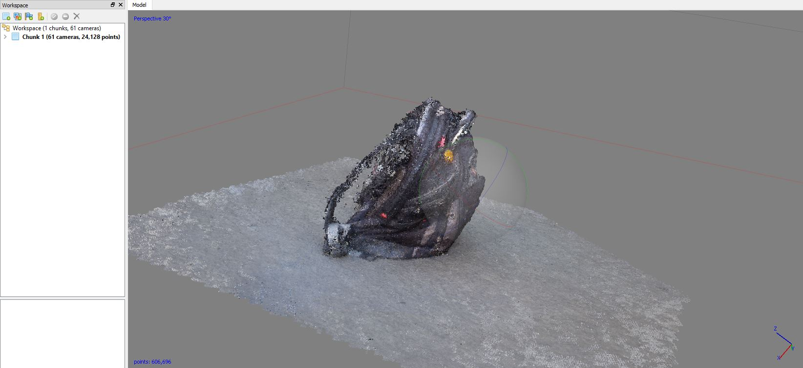
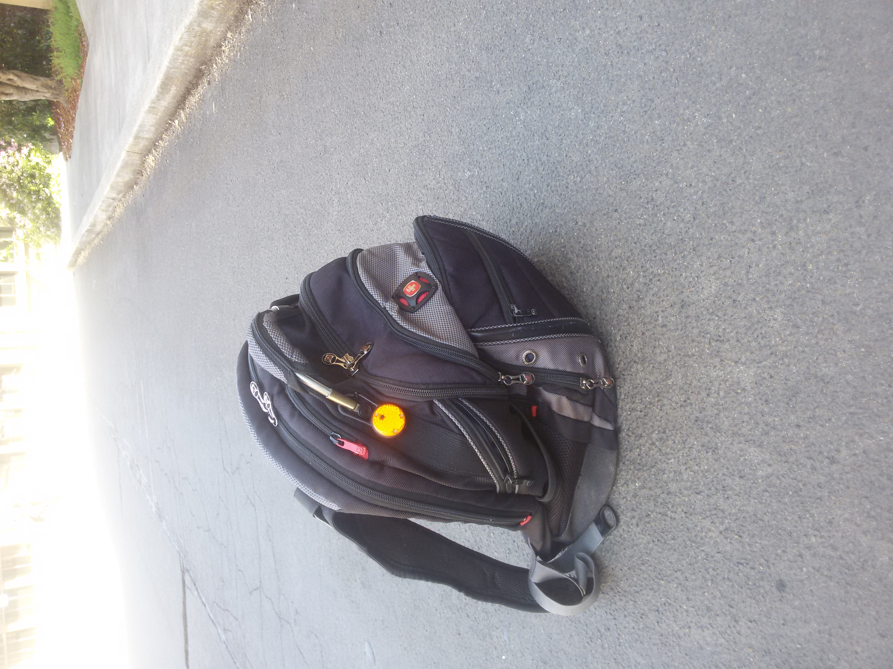
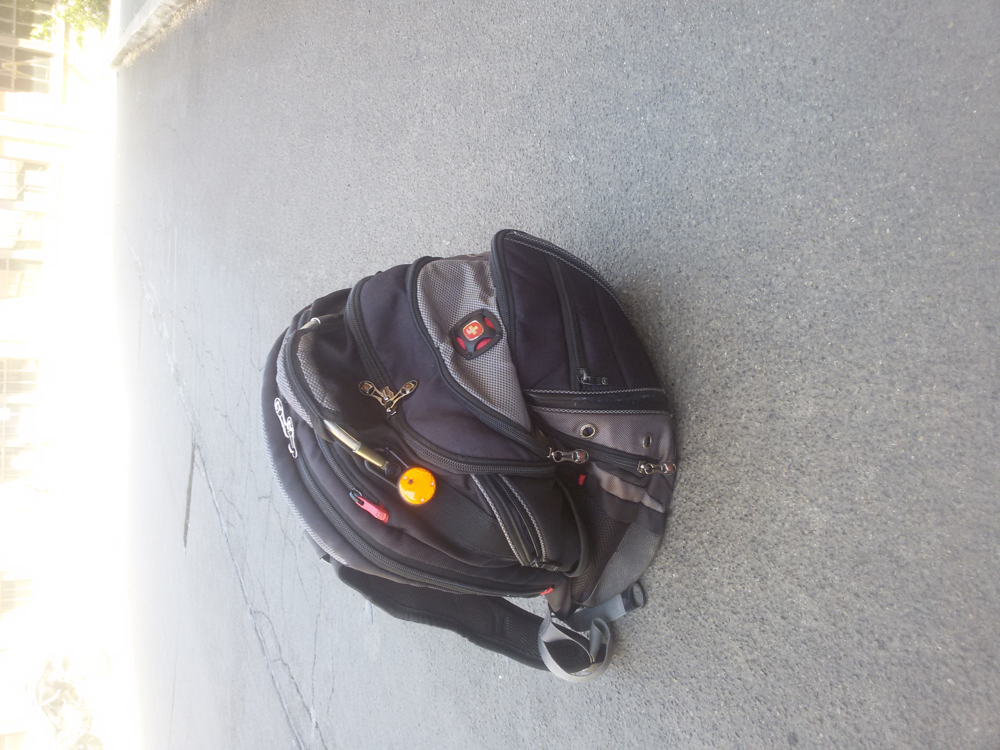
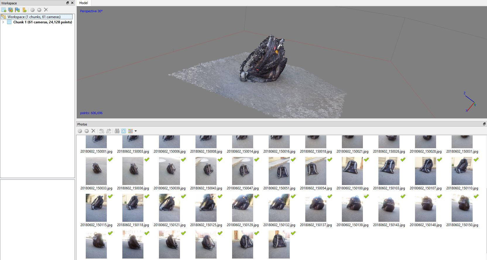
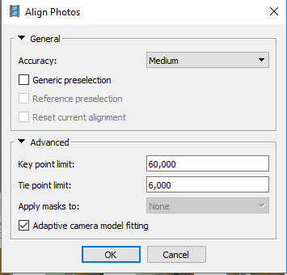
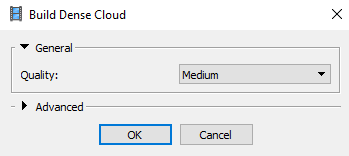
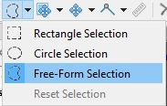
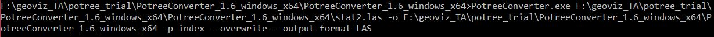

# Lab6-potree
##### By Hoda Tahami
Project with the primary goal of adding SfM images into a potree viewer.

## Project summary

At first we took 61 picture in different angles from my bag pack and add them to the Agisoft 
Photo scan. You can see two of them below.

After adding point from the workflow tap, use the align photos to align all
 photos. In this step I used medium option for the accuracy.
 
 
 
 
  
 Then used the densecloud to see the better point cloud.
 
  
   
At next step for editing the point cloud I used the Free-Form Selection to
 delete the extra points.
 
 
  
 Finally export the file in format of .las.
 
In next step, I download the Potree Conversion 1.6 release and download the zip file.
 Then place them in a folder that will solely be dedicated to this Potree page.
  next I Extract the files in this location.
  Next, I place the LAS file in this folder. Using the command prompt, run the following code from the same
   folder that I have just created:
   
  
  
  PotreeConverter.exe G:\input.las -o G:\output -p index --overwrite --output-format LAS

In last step, by running the index.html we can see the result.

